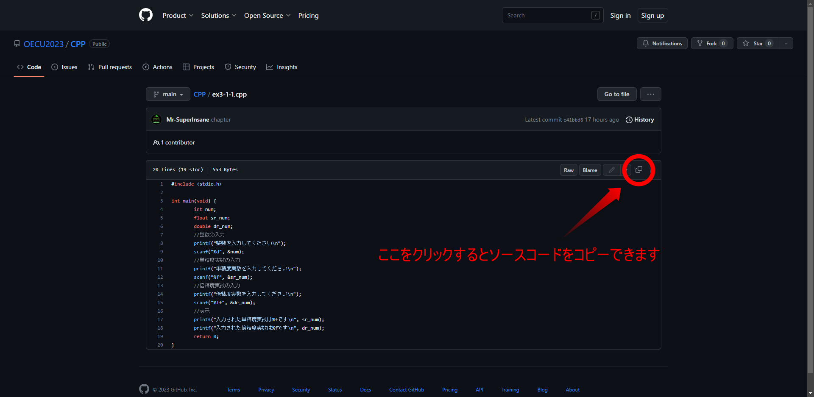

# ソースコードをコピーする方法

ソースコードは上記のファイル一覧から選択すると閲覧できます。    
  

# プログラミングの質問をする方法

プログラミング入門演習1/2の範囲に関して質問したい人はこちら↓↓↓

[>>>質問する<<<](https://gist.github.com/Mr-SuperInsane/499d308d2562d43064fd04c382142e0b)
